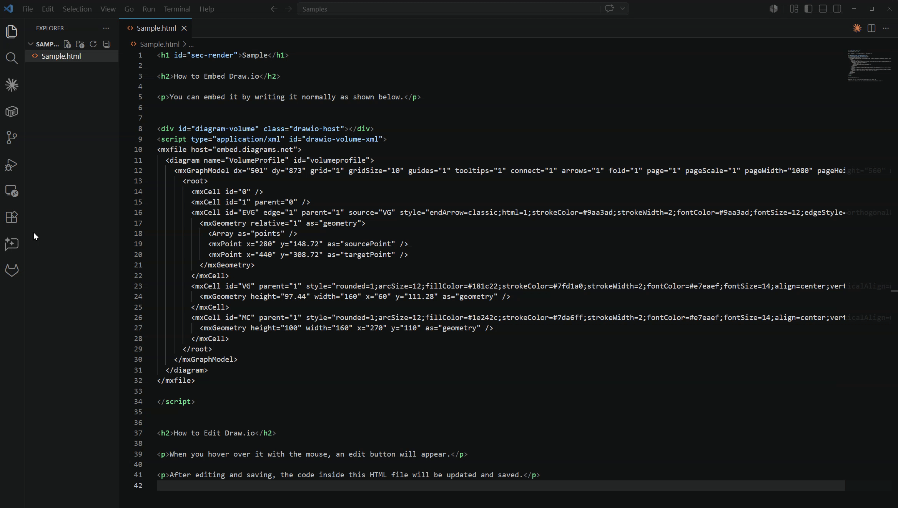

# Drawio in HTML

**English** | [日本語](./README.ja.md)

[](https://marketplace.visualstudio.com/items?itemName=Maku.drawio-in-html)
[](https://opensource.org/licenses/MIT)
[](https://github.com/oSUiMiNo/DrawioInHtml)

A VSCode extension that previews HTML files in place and lets you view and edit embedded Drawio diagrams inline. Edits are auto-saved back into the same HTML file, so **one file holds both the document and its diagrams** — no separate `.drawio` files to keep in sync.

## What it does

- Renders the HTML body (headings, paragraphs, tables, images) as a live preview
- Renders embedded Drawio diagrams inline at their original location
- On hover, each diagram shows **🔍** (fullscreen) and **✏️** (edit) icons
- Press ✏️ to open the official Drawio editor in a side tab
- Saving in the editor automatically updates the source HTML on disk
- Multiple diagrams per HTML file, each editable independently
- Automatically follows VSCode's dark / light theme
- Diagrams automatically rescale to the editor width

### Edit demo



### Resize demo (adapts to window width)


## Requirements

- VSCode 1.85.0 or later
- Internet access **only while editing** (the preview itself runs offline)

## Install

Search `drawio-in-html` in the Extensions side bar of VSCode, or:

```sh
code --install-extension Maku.drawio-in-html
```

## How to embed a diagram in HTML

The extension recognizes **two embed formats** — use whichever suits you.

### A. Simple form (script tag with id)

```html
<script type="application/xml" id="my-diagram">
<mxGraphModel>
  <root>
    <mxCell id="0"/>
    <mxCell id="1" parent="0"/>
    <mxCell id="2" value="API" style="rounded=0;whiteSpace=wrap;html=1;" vertex="1" parent="1">
      <mxGeometry x="40" y="40" width="120" height="60" as="geometry"/>
    </mxCell>
  </root>
</mxGraphModel>
</script>
```

- Plain HTML5 inline-data-block usage — browsers ignore it, so no side effects
- The `id` value (`"my-diagram"` above) must be unique within the HTML file
- Body can be either `<mxGraphModel>...</mxGraphModel>` or `<mxfile>...</mxfile>`
- Easiest workflow: drop an empty `<script>` with an arbitrary `id` and start drawing from ✏️
- To render in a plain browser too, add a mount script that reads the same `id` — see [developer docs](./README.dev.html) (Japanese)

### B. Drawio's official export form (mxgraph div)

```html
<div class="mxgraph" data-mxgraph='{"highlight":"#0000ff","nav":true,"resize":true,"xml":"<mxfile>...</mxfile>"}'></div>
<script src="https://viewer.diagrams.net/js/viewer-static.min.js"></script>
```

- This is exactly what Drawio's "Extras → Edit Diagram → Publish → HTML" (or "Embed → HTML") emits
- The XML lives as a JSON string inside the host div's `data-mxgraph` attribute
- **Renders in both a plain browser and this extension with no edits at all**
- Identifier is the div's `id` attribute. If absent, the extension auto-assigns `drawio-mxgraph-1`, `drawio-mxgraph-2`, ... in document order
- Lets you take a Drawio-published HTML straight into VSCode for editing

## Usage

| What you want to do | How |
|---|---|
| Open the preview (shortcut) | `Ctrl+Shift+V` (Mac: `Cmd+Shift+V`) |
| Open the preview (context menu) | Right-click in the Explorer or on the editor tab → **Drawio in HTML: Open Preview** |
| Open the preview (other) | Right-click → Open With → Drawio HTML Editor |
| Zoom a diagram | Hover the diagram → 🔍 |
| Exit fullscreen | `ESC` or ✕ |
| Edit a diagram | Hover the diagram → ✏️ |
| Save your edits | The 💾 button in the Drawio editor — the HTML file is saved automatically too |
| Back to plain HTML editing | Close the preview tab and reopen the file with double-click |

### Make this preview the default for `.html` (optional)

If you always want this preview when you double-click an HTML file, add the following to your VSCode `settings.json`:

```json
"workbench.editorAssociations": {
  "*.html": "drawioInHtml.editor"
}
```

Remove the entry to revert.

## Theme

- The preview automatically follows VSCode's dark / light theme.
- If your HTML's `<style>` sets a background or text color explicitly, your styles win — the extension does not override them.

## ⚠️ Security note

This preview **executes any JavaScript embedded in the HTML you open** — this is necessary so that CDN libraries such as Mermaid can run inside the preview.

That means **opening someone else's HTML, or HTML you found on the web, may execute its scripts** and could:

- Make outbound requests to unknown sites
- Send personal data to third parties
- Hijack browser behavior (the kind of attack known as XSS)

**To stay safe:**

- Only open **HTML you wrote yourself**
- For untrusted HTML, inspect the source in a plain text editor before opening it in the preview

Think of this preview as having the same level of risk as opening the HTML directly in a browser. "Just a VSCode preview" does not imply extra safety.

## For developers

Internal architecture, marker spec, and contribution notes are in [README.dev.html](./README.dev.html) (currently Japanese only). Open it with this extension to see an embedded Drawio architecture diagram in action.

## License & credits

- The bundled `viewer-static.min.js` is from [drawio (jgraph/drawio)](https://github.com/jgraph/drawio)
- Editing is powered by [embed.diagrams.net](https://embed.diagrams.net/) inside an iframe
- Source code is MIT licensed — see [LICENSE](./LICENSE)
